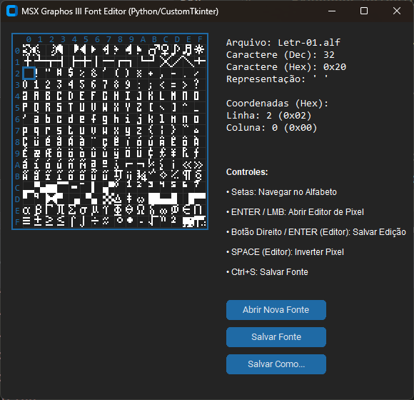

## 💾 MSX Graphos III Font Editor

Um editor de alfabetos (fontes) para o MSX, suportando o formato binário padrão do famoso editor Graphos III. Desenvolvido em Python com uma interface gráfica moderna e persistência de dados via SQLite.

### 🖼️ Visualização da Interface

A interface é construída usando **CustomTkinter**, priorizando um tema escuro e visual limpo, com a grade 16x16 em destaque.

---

### ✨ Tecnologias Envolvidas

| Categoria | Tecnologia | Uso no Projeto |
| :--- | :--- | :--- |
| **Linguagem** | Python 3.x | Lógica principal, manipulação de arquivos e GUI. |
| **Interface Gráfica** | `customtkinter` | Criação de uma interface de usuário moderna, responsiva e com tema escuro, baseada no `tkinter`. |
| **Persistência** | `sqlite3` (Módulo Padrão) | Armazenamento do arquivo de configuração (e.g., caminho da fonte padrão). |
| **Manipulação Binária** | `struct` (Módulo Padrão) | Leitura e escrita do cabeçalho binário no formato LSB/MSB do MSX. |
| **Formato Específico** | Arquivo `.ALF` (Graphos III) | Formato binário do alfabeto MSX (256 caracteres, 8x8 pixels, 8 bytes por caractere). |

---

### 🎯 Funcionalidades e Escopo do Programa

O editor foi projetado especificamente para manipular o conjunto de caracteres (ASCII 0-255) do VDP (Video Display Processor) do MSX, aplicável aos modos `SCREEN 0`, `SCREEN 1` e `SCREEN 2`.

#### 1. Gerenciamento de Configuração (SQLite)

* **Configuração Inicial:** Ao primeiro uso, o programa verifica a existência do arquivo `msx_font_editor.db`. Se não existir, ele solicita ao usuário o caminho do arquivo `.ALF` de fonte padrão e armazena essa informação.
* **Persistência:** O caminho da fonte padrão é salvo, permitindo que o editor a carregue automaticamente em usos futuros.

#### 2. Manipulação de Arquivo BINÁRIO (`.ALF`)

* **Leitura:** Lê o arquivo binário `.ALF`, ignorando os 7 bytes do cabeçalho (padrão MSX BINARY: `&FE` seguido pelos endereços `$9200`, `$99FF`, `$9200` em LSB/MSB) e carrega os 2048 bytes de dados de 256 caracteres.
* **Escrita:** Reconstrói o arquivo `.ALF`, inserindo o cabeçalho binário padrão `$FE 00 92 FF 99 00 92` seguido pelos 2048 bytes de dados dos caracteres.

#### 3. Visualização Principal (16x16 Grid)

* **Grade Completa:** Exibe todos os 256 caracteres (ASCII 0-255) em uma matriz de $16 \times 16$ células. Cada caractere é renderizado como uma imagem $8 \times 8$ (escalada para melhor visualização).
* **Coordenadas:** A grade é rotulada com coordenadas hexadecimais (0-F) nas linhas e colunas, facilitando a identificação do código do caractere: `Código = (Linha_Hexa * 16) + Coluna_Hexa`.
* **Indicador de Alteração:** Caracteres que foram modificados pelo usuário são exibidos com uma cor de fundo escura diferenciada (e.g., bordô escuro), permitindo rastrear as mudanças antes de salvar.
* **Cursor de Seleção:** Permite navegar pelos caracteres usando as teclas de **seta** ou o **clique esquerdo** do mouse.
* **Painel de Informação:** Exibe o **Código (Decimal e Hexadecimal)** e as **Coordenadas (Hexadecimal)** do caractere atualmente selecionado.

#### 4. Editor de Caractere (8x8 Pixel Grid)

* **Ativação:** Abre ao selecionar um caractere na grade principal e pressionar **`<ENTER>`** ou **clicar duas vezes**.
* **Edição de Pixel:**
    * O usuário pode controlar um cursor dentro da grade $8 \times 8$.
    * Pressionar **`<ESPAÇO>`** ou **clicar esquerdo** do mouse inverte o estado do pixel selecionado (ligado/desligado).
* **Saída e Salvamento:**
    * Pressionar **`<ENTER>`** ou o **botão direito do mouse** confirma as alterações, copia o novo padrão de 8 bytes para a memória da fonte principal e fecha o editor.
    * A tela principal é atualizada, e o caractere modificado recebe a marcação de cor diferente.

---

### ⚙️ Estrutura de Funções Projetadas

O projeto é organizado em classes para modularizar a lógica:

#### 1. Funções de Configuração Global

| Função | Descrição |
| :--- | :--- |
| `setup_config()` | **Cria e verifica** o arquivo `msx_font_editor.db`. Solicita o caminho da fonte `.ALF` ao usuário se for a primeira execução. |
| `set_config(key, value)` | Armazena um par chave/valor na tabela `configuracao` do SQLite. |

#### 2. Classe `MSXFont` (Lógica de Dados)

| Método | Descrição |
| :--- | :--- |
| `__init__(filepath)` | Inicializa a fonte, carregando os dados do arquivo `.ALF` e validando o cabeçalho. |
| `_load_font()` | Lógica interna para ler o arquivo binário, tratar erros de tamanho/cabeçalho e retornar a lista de 256 padrões de 8 bytes. |
| `get_char_pattern(ascii_code)` | Retorna o padrão de 8 bytes para um código ASCII/MSX específico. |
| `update_char_pattern(ascii_code, new_pattern)` | Atualiza o padrão de um caractere na memória e o marca no `modified_chars` set. |
| `save(filepath=None)` | Grava o cabeçalho Graphos III e os 2048 bytes de dados no arquivo `.ALF` especificado. |

#### 3. Classe `EditorWindow` (Janela 8x8)

| Método | Descrição |
| :--- | :--- |
| `__init__(master, char_code, pattern, callback)` | Inicializa a janela de edição, convertendo o padrão de 8 bytes em uma matriz 8x8 de 0s/1s. |
| `draw_editor()` | Desenha os pixels ON/OFF na grade ampliada do `Canvas`. |
| `toggle_pixel(r, c)` | Inverte o estado de um pixel específico na matriz de dados. |
| `save_and_close()` | Converte a matriz 8x8 de volta para 8 bytes e chama o `callback` da janela principal. |

#### 4. Classe `FontEditorApp` (Janela Principal)

| Método | Descrição |
| :--- | :--- |
| `__init__(default_font_path)` | Configura a janela principal `customtkinter.CTk` e todos os frames e widgets. |
| `draw_grid()` | Desenha as linhas e rótulos de coordenadas do `Canvas` principal. |
| `draw_font()` | Itera sobre os 256 caracteres, desenhando seus pixels e o fundo de "modificado" no `Canvas`. |
| `draw_cursor()` | Desenha o retângulo de seleção azul (`COLOR_CURSOR`) no caractere ativo. |
| `on_editor_close(char_code, new_pattern)` | Função de *callback* que recebe o padrão editado, atualiza a fonte e força o redesenho do caractere. |